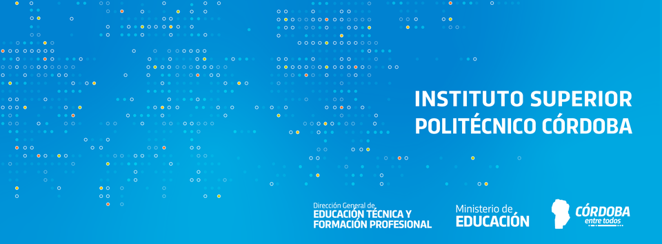

# Bienvenidos al repositorio de Trabajos Grupales

### Docentes: 

- 👩‍🏫 Farini Natalia - Docente en Ética y deontología 
- 👨‍🏫 Kessler Kevin - Docente en Bases de Datos
- 👨‍🏫 Lanfranco Lisandro - Docente en Programación

### Colaboradores:
- :heavy_check_mark: Ale Ulises - Estudiante de Tec. Sup. en Telecomunicaciones 

---
### Año 2023

